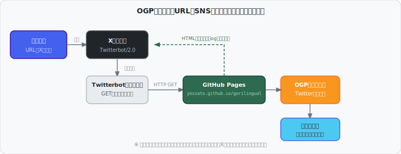
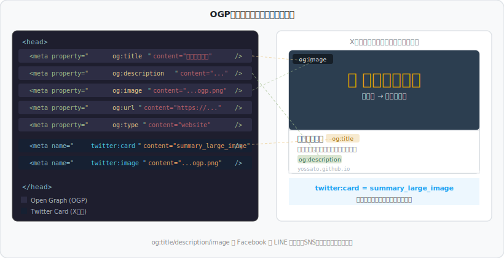
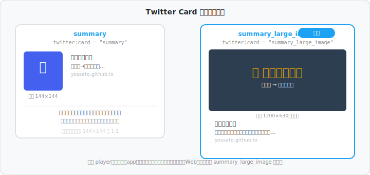

# OGPとSNSプレビューの仕組み

> ゴリリンガルのSNSカード表示がどう実現されているかを解説します。

---

## 1. OGPとは？

**OGP（Open Graph Protocol）** とは、Webページが「どんなページか」をSNSに伝えるためのメタデータ規格です。2010年にFacebook（Meta）が策定し、現在はX（Twitter）・LINE・Slack・Discord など主要なSNS・メッセージングアプリが広くサポートしています。

`<head>` 内に `<meta property="og:...">` タグを記述することで、ページのタイトル・説明・画像などを機械可読な形で宣言します。

---

## 2. URLをSNSに共有したとき何が起きるか

URLをSNSに投稿した瞬間から、以下の流れで**プレビューカード**が生成されます。



1. **ユーザーが投稿** — URLをSNSに貼り付けて送信
2. **SNSのクローラーが取得** — `Twitterbot/2.0` などのボットが対象URLに HTTP GET リクエストを送信
3. **HTMLのmetaタグを解析** — `<head>` 内の OGP タグを読み取る
4. **結果をキャッシュ** — クローラーが取得した情報を保存（以降は再クロールしない）
5. **カードとして表示** — タイムライン上にタイトル・説明・画像付きのカードが展開

> **ポイント**: クロールは最初の共有時（または手動更新時）に実行されます。  
> X（Twitter）では [Card Validator](https://cards-dev.twitter.com/validator) でキャッシュを強制更新できます。

---

## 3. OGPメタタグの種類と役割



### Open Graph タグ（OGP本体）

| タグ | 役割 | ゴリリンガルでの値 |
|------|------|-------------------|
| `og:title` | ページタイトル | `ゴリリンガル` |
| `og:description` | 説明文（〜200文字） | `日本語テキストをウホッ！？に…` |
| `og:image` | プレビュー画像のURL | `https://…/ogp.png` |
| `og:url` | ページの正規URL | `https://yossato.github.io/gorilingual/` |
| `og:type` | ページの種別 | `website` |

### Twitter Card タグ（X独自の拡張）

| タグ | 役割 | ゴリリンガルでの値 |
|------|------|-------------------|
| `twitter:card` | カードの表示形式 | `summary_large_image` |
| `twitter:title` | タイトル（省略時は `og:title`） | （省略 → `og:title` 使用） |
| `twitter:description` | 説明文（省略時は `og:description`） | （省略） |
| `twitter:image` | 画像URL（省略時は `og:image`） | `https://…/ogp.png` |

> OGP タグと Twitter Card タグは**共存可能**で、X は Twitter Card タグを優先、他SNSは OGP タグを使います。両方書いておくことで全SNS対応できます。

---

## 4. Twitter Card のタイプ

X（Twitter）には4種類のカードタイプがあります。



| タイプ | 画像サイズ | 用途 |
|--------|-----------|------|
| `summary` | 144×144（正方形、小） | テキスト中心のページ |
| `summary_large_image` | 1200×630（横長、大）| **ゴリリンガル採用** — 視覚的なアピール向き |
| `player` | 動画プレーヤー付き | 動画コンテンツ |
| `app` | アプリダウンロード | モバイルアプリ |

一般的なWebサービスでは **`summary_large_image`** が最も効果的です。大きな画像がタイムラインで目立ちます。

---

## 5. OGP画像の仕様


| 項目 | 値 |
|------|----|
| **推奨サイズ** | **1200 × 630 px** |
| 最小サイズ | 600 × 315 px |
| アスペクト比 | **1.91 : 1** |
| ファイル形式 | PNG（推奨） / JPEG |
| ファイルサイズ | 5 MB 以下（X/Twitter） |
| 色空間 | sRGB |

ゴリリンガルの `ogp.png` は Python（Playwright）でHTMLをスクリーンショット撮影して生成しました：

```python
from playwright.sync_api import sync_playwright

with sync_playwright() as p:
    browser = p.chromium.launch()
    context = browser.new_context(
        viewport={"width": 1200, "height": 630},
        device_scale_factor=1  # Retinaディスプレイでも1倍で出力
    )
    page = context.new_page()
    page.goto("file:///path/to/ogp_source.html")
    page.screenshot(path="ogp.png")
```

> `device_scale_factor=1` が重要です。Mac の Retina ディスプレイ環境で省略すると  
> `device_scale_factor=2` になり、2400×1260 の画像が生成されてしまいます。

---

## 6. キャッシュの問題と更新方法

OGPの情報はSNS側にキャッシュされるため、**画像やタイトルを変更しても即座には反映されません**。

### X（Twitter）の場合

1. [Card Validator](https://cards-dev.twitter.com/validator) を開く
2. URLを入力して「Preview card」をクリック
3. 再クロールが実行されキャッシュが更新される

### Facebook / OGPデバッガー

1. [OGP Debugger](https://developers.facebook.com/tools/debug/) にアクセス
2. URLを入力して「Fetch new information」をクリック

---

## 7. ゴリリンガルでの実装

`index.html` の `<head>` に以下を追加しています：

```html
<!-- Open Graph Protocol -->
<meta property="og:title"       content="ゴリリンガル" />
<meta property="og:description" content="日本語テキストをウホッ！？言語に変換するツール。5進ハフマン符号で最大約47%圧縮。" />
<meta property="og:image"       content="https://yossato.github.io/gorilingual/ogp.png" />
<meta property="og:url"         content="https://yossato.github.io/gorilingual/" />
<meta property="og:type"        content="website" />

<!-- Twitter Card (X) -->
<meta name="twitter:card"  content="summary_large_image" />
<meta name="twitter:image" content="https://yossato.github.io/gorilingual/ogp.png" />
```

**X（Twitter）のCard Validatorで「Card loaded successfully」を確認済みです。**

---

## 参考リンク

- [Open Graph Protocol 公式](https://ogp.me/)
- [Twitter Cards ドキュメント](https://developer.twitter.com/en/docs/twitter-for-websites/cards/overview/abouts-cards)
- [Card Validator（X）](https://cards-dev.twitter.com/validator)
- [OGP デバッガー（Facebook）](https://developers.facebook.com/tools/debug/)
