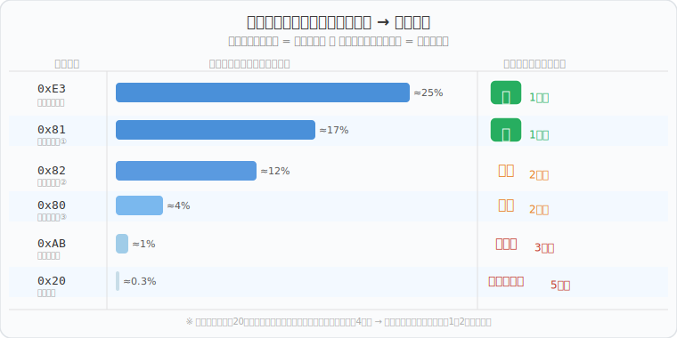
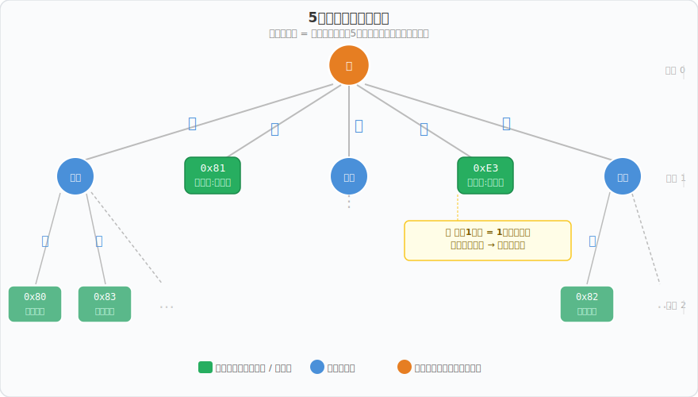
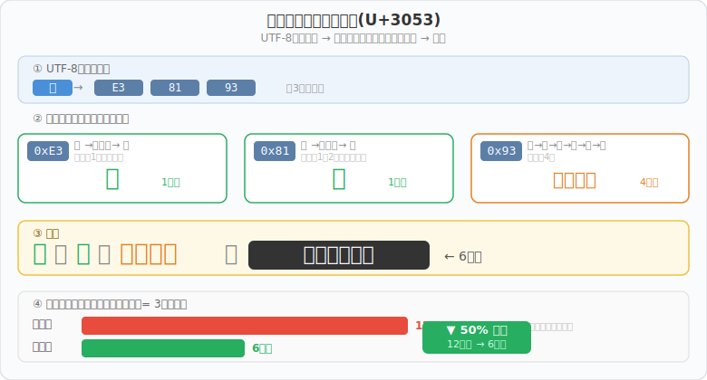
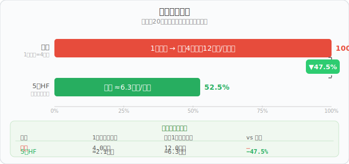

# 5進ハフマン符号化（ゴリリンガル）

ゴリリンガルの「圧縮」機能で使われる **5進ハフマン符号化** の仕組みを解説します。

---

## 1. ハフマン符号化とは？

**ハフマン符号化**は、文字の出現頻度に応じてコードの長さを変える可逆圧縮アルゴリズムです。

- 頻繁に出てくる記号 → **短いコード**
- めったに出ない記号 → **長いコード**

モールス信号の「E（一番短い：・）」が英語で最頻出の文字であるのと同じ発想です。



### プレフィックスフリー性

ハフマン符号の重要な性質として、**どのコードも他のコードの先頭部分にならない**という特徴があります（プレフィックスフリー）。これにより、区切り文字なしに連結されたコードを左から読んでいくだけで、確実にバイト境界を見つけられます。

---

## 2. なぜ「2進」ではなく「5進」？

通常のハフマン符号化は **2進木**（枝が0と1の2本）を使います。  
ゴリリンガルには `ウ・ホ・ッ・！・？` の **5文字** が使えるので、**5進木**（枝が5本）を使います。

| | 2進ハフマン | **5進ハフマン** |
|:---:|:---:|:---:|
| 枝の数 | 2（0 / 1） | **5（ウ/ホ/ッ/！/？）** |
| 256記号に必要な木の深さ | log₂(256) = **8段** | log₅(256) ≈ **3.4段** |
| 最長コードの目安 | 〜8文字 | 〜4文字 |

5進木は枝が多い分、**木の深さが約半分**で済みます。

---

## 3. 日本語UTF-8のバイト頻度

日本語テキストをUTF-8で表すと、特定のバイト値が極端に高頻度で登場します。

```
「こんにちは」の UTF-8 バイト列：
E3 81 93  E3 82 93  E3 81 AB  E3 81 A1  E3 81 AF
↑共通      ↑継続バイト  ...
```

ひらがなは全て `E3 8x xx` か `E3 9x xx` の形なので：

- **`0xE3`**（先頭バイト）が圧倒的最頻出 ≈ 25%
- **`0x81`**（継続バイト①）が2位 ≈ 17%
- **`0x82`**（継続バイト②）が3位 ≈ 12%
- スペース`0x20`などはほぼ出現しない ≈ 0.3%

→ この偏りを利用して短いコードを割り当てます。

---

## 4. 5進ハフマン木の構築

### アルゴリズム（優先度キュー版）

```
1. 全256バイト値に頻度を割り当て
   （サンプル未登場のバイトには最低頻度 1 を付与 ← スムージング）
2. 頻度が最小の 5 ノードを取り出す
3. それらを子ノードとする新しい内部ノードを作成
   （頻度 = 子5つの合計）
4. 新ノードを優先度キューに追加
5. ノードが 1 つになるまで 2〜4 を繰り返す
```

> **なぜ5つずつ取り出す？**  
> 5進木なので各内部ノードには必ず5本の枝が生えます。  
> ノード数が `1 + 4k` になるよう、最初にダミーノード（頻度0）で数を調整します。

### 構築された木の構造

高頻度バイトほど**木の浅い位置**（根に近い場所）に配置されます。



- **深さ1の葉** = 1文字コード（0xE3→「！」、0x81→「ホ」など）
- **深さ2の葉** = 2文字コード（0x82→「？ウ」、0x80→「ウ！」など）
- **深さ4〜5の葉** = 4〜5文字コード（稀少バイト）

---

## 5. エンコードの仕組み

各バイトを **事前計算したテーブル**（256エントリ）から引くだけです。

```python
# 擬似コード
def encode(text: str) -> str:
    bytes_ = text.encode('utf-8')
    return ''.join(HUFFMAN_TABLE[b] for b in bytes_)
```

実際のエンコード例：



```
「こ」(U+3053)
  └─ UTF-8: E3  81  93
       ↓
  0xE3 →「！」   (1文字)
  0x81 →「ホ」   (1文字)
  0x93 →「？！ッ？」(4文字)
       ↓
  連結：「！ホ？！ッ？」 (6文字)
  標準：               (12文字)
  削減：                50% ！
```

---

## 6. デコードの仕組み

プレフィックスフリーの性質を利用して、**左から1文字ずつ読みながら辞書を引きます**。

```
入力文字列：！ホ？！ッ？...

「！」     → 辞書に一致！→ 0xE3 を確定
「ホ」     → 辞書に一致！→ 0x81 を確定
「？」     → まだ一致なし
「？！」   → まだ一致なし
「？！ッ」 → まだ一致なし
「？！ッ？」→ 辞書に一致！→ 0x93 を確定

→ [0xE3, 0x81, 0x93] をUTF-8デコード → 「こ」
```

> どの段階でも「どのコードの先頭とも一致しない文字が来る」ことはないので、
> 途中で迷子になりません（プレフィックスフリーの保証）。

---

## 7. 圧縮率



| エンコード方式 | 1バイトあたり | 漢字1文字あたり | vs 標準 |
|:---:|:---:|:---:|:---:|
| 標準（固定長） | 4.0文字 | 12.0文字 | — |
| **5進ハフマン** | **≈2.1文字** | **≈6.3文字** | **−47.5%** |

---

## 8. 静的テーブル方式の利点

ゴリリンガルでは**事前計算した固定テーブル**を採用しています。

```
動的ハフマン（一般的な方式）
  入力テキストごとに木を構築 → コードをテキスト先頭に付加して送る
  短いテキストではヘッダーが大きすぎて逆効果になることも

静的ハフマン（ゴリリンガルの方式）
  サンプル20文から1回だけ木を構築 → テーブルを固定
  ヘッダー送信が不要 → どんな短いテキストでも必ず47%前後削減
```

### マジックプレフィックス

圧縮データの先頭8文字は `0xFF 0xFD` の標準エンコード値（固定値）になっています。  
デコーダーはこの8文字を見ることで「これは圧縮データだ」と自動判別します。

```
圧縮出力例：
ッッ！？ウウッッ？！ホ？！ッ？...
└────────┘
 マジック8文字
(0xFF→4文字 + 0xFD→4文字)
```

---

## 9. ゴリリンガルでの実装まとめ

```
[256エントリのテーブル]
  STATIC_ENC[0]   = "？？ウホッ"    ← 0x00 (null)
  STATIC_ENC[129] = "ホ"           ← 0x81 (最頻出2位)
  STATIC_ENC[227] = "！"           ← 0xE3 (最頻出1位)
  ...

エンコード：
  text → UTF-8バイト列 → 各バイトを STATIC_ENC で引く → 連結

デコード：
  文字列を左から読む → STATIC_DEC（逆引き辞書）でバイトを復元 → UTF-8デコード
```

テーブルは[huffman_analysis.py](./huffman_analysis.py)で生成されています。

---

*ゴリリンガル: https://yossato.github.io/gorilingual/*
